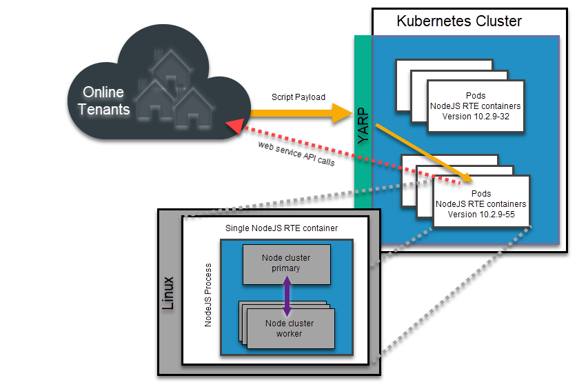
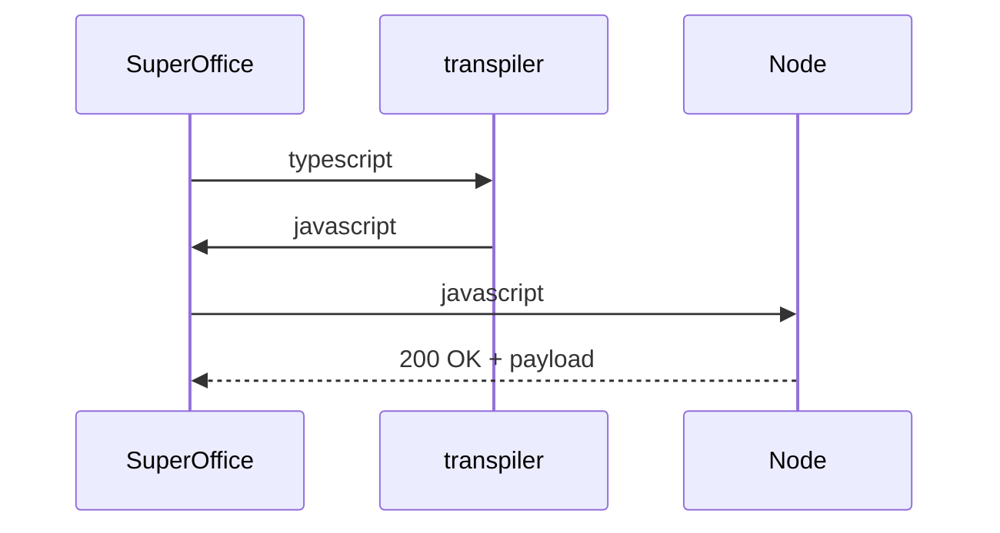

# [Typescript for SuperOffice]

- **Spec ID:** `Typescript for SuperOffice`
- **Status:** Final
- **Version:** 1.0
- **Created:** 2025-09-19
- **Updated:** 2025-09-24

---

## 📖 Overview

In the dynamic world of CRM customization, the tools and platforms we use are pivotal. SuperOffice CRM, a stalwart in the CRM landscape, has always been at the forefront of innovation. The introduction of TypeScript for SuperOffice marks a significant evolution in the platform’s scripting capabilities, offering a more versatile, efficient, and powerful environment for building sustainable automation and integrations. This article delves into the intricacies of TypeScript for SuperOffice, elucidating its transformative features and the opportunities it presents.

Typescript for SuperOffice (tsfso) enables developers to write scripts and triggers in typescript.

---

## 🎯 Goals

- Use a standard/more widely used language to create scripts in SuperOffice.
- Old CRMScripts were executed by the service-client synchronously. Typescript will be executed by a node cluster and therefore does not affect performance with long-running scripts.
- By leveraging Node.js, a leading server-side JavaScript runtime, TypeScript for SuperOffice offers a high-performance, scalable environment. This not only enhances script execution speed but also provides access to Node.js’s extensive module ecosystem.

---

## 🚫 Non-Goals (Optional)

- Examples on how to write scripts, this can be found a [separate repository](https://github.com/SuperOffice/typescript-for-superoffice)
- vscode extension for working with scripts outside of SuperOffice

---

## 🛠️ Technical Specification

- Writing scripts will be similar/identical to using the existing [@superoffice/webapi](https://www.npmjs.com/package/@superoffice/webapi) on npm.

- Typescript will be transpiled into javascript, which will be sent off to the Node.js application. [Online architecture](#online-architecture) explains the execution more in detail.

### Online architecture

- Upon execution a Typescript by a tenant, an HTTP request is dispatched to the Node.js Service within the Kubernetes environment.

- YARP determines the version currently in use by the tenant. Subsequently, the request is routed to a Service that operates the corresponding version of the RTE (Run-Time Environment).

- The targeted container initiates a node application. This application leverages the Node Cluster module to efficiently distribute incoming requests to an appropriate worker.

- Once received, the worker decomposes the request into several components: the JavaScript intended for execution, context variables (such as EventData), and NetServer connection details. Following this, the JavaScript is executed. During its operation, the JavaScript might interface with the NetServer API. Upon completion, a context object is returned, encompassing output, EventData, tracing, and other relevant information.

- Post-execution, the worker process is terminated. The primary process then generates a new worker process. This new worker undergoes initialization, which includes loading the RTL (Run-Time Library), and subsequently prepares to handle incoming requests.



#### Script Example

```typescript
const name = "NewName";

const agent = soApi.getContactAgent();
let entity = await agent.createDefaultContactEntityAsync();
entity.name = name;
entity = await agent.saveContactEntityAsync(entity);
context.result.body = JSON.stringify(entity);
```

### Workflows / Diagrams (Optional)

Describe how this spec fits into workflows.
Mermaid diagram example:



---

## 📦 Backward Compatibility

For backwards compatibility, TypeScript for SuperOffice includes a transpiler that transforms existing CRMScript code into JavaScript. This ensures that while solutions written with CRMScript will continue to function, the execution harnesses the power and efficiency of JavaScript – the preferred method going forward.

---

## 🌐 Security & Compliance

Security is paramount, especially when transitioning to a new execution environment like Node.js and integrating with modern web technologies. Given the information provided on TypeScript for SuperOffice, here's a comprehensive look at the security considerations being addressed:

### Script Execution

- Use of eval(): The use of JavaScript's eval() function, which evaluates and executes a string as code, raises significant security concerns due to its potential for code injection attacks. Alternatives and safeguards are being explored to mitigate these risks.
- Isolation: Ensuring that scripts run in isolated environments, so one script or tenant cannot interfere with or access the data of another, is crucial. This is particularly important when considering multi-tenancy in a Node.js environment.

### Node.js Environment

- File and Network Access: Restricting scripts from accessing the file system or making unauthorized network requests is essential. This prevents potential data leaks or malicious activities.
Resource Limitations: Implementing resource limitations ensures that a script cannot consume excessive CPU, memory, or other resources, which could lead to denial-of-service attacks.
- Module Restrictions: If allowing the use of NPM packages, ensuring that only safe and vetted packages are used is crucial. This prevents potential vulnerabilities introduced by third-party code.

### API Interactions

- Rate Limiting: Implementing rate limits on API calls prevents abuse and potential denial-of-service attacks.
Data Validation: Ensuring that all data sent to and received from APIs is validated can prevent potential injection attacks or data corruption.
- Authentication and Authorization: Ensuring that scripts can only make authorized API calls and cannot access or modify data without appropriate permissions.

### Transpilation Process

- Code Integrity: Ensuring that the transpilation process does not introduce vulnerabilities or alter the intended functionality of the script is essential.
- Obfuscation and Minification: While primarily used for performance, these can also add a layer of security by making the transpiled code harder to read and understand.

### Data Handling

- Sensitive Data: Ensuring that scripts do not inadvertently expose or mishandle sensitive data, such as personal information or credentials, is crucial.
- Data Encryption: Implementing encryption for data at rest and in transit adds an additional layer of security.

### Monitoring and Logging

- Activity Monitoring: Keeping a watchful eye on script execution, API calls, and other activities can help detect and respond to suspicious activities quickly.
- Logging: Maintaining detailed logs aids in post-incident analysis and can provide insights into potential vulnerabilities or attack vectors.

### Updates and Patching

- Regular Updates: Keeping the Node.js environment and all associated libraries up-to-date ensures that known vulnerabilities are patched.
- Vulnerability Scanning: Regularly scanning the environment for vulnerabilities and addressing them proactively.

### Training and Best Practices

- Developer Training: Ensuring that those writing scripts are aware of best practices and potential security pitfalls can prevent many common vulnerabilities.
- Code Reviews: Implementing regular code reviews can catch potential security issues before they reach the production environment.

In essence, as SuperOffice integrates TypeScript for SuperOffice with a Node.js execution environment, a multi-faceted approach to security is being adopted. From the foundational level of script execution to the broader environment in which scripts run, every aspect is being scrutinized and fortified to ensure a secure scripting experience for SuperOffice CRM consultants.

---

## 📅 Implementation & Rollout

- Phase 1: Option to write new scripts in typescript.
- Phase 2: Transpile existing crmscripts into javascript.
- Phase 3: Discontinue support for crmscript. At this stage all existing scripts are transpiled.

---

## 📎 References

- Related proposals: [../proposals/2025/001-webhooks-improvements.md](../proposals/2025/001-webhooks-improvements.md)
- Related RFCs: [../rfcs/2025/001-example.md](../rfcs/2025/nnn-placeholder.md)
- External standards (e.g., [OAuth 2.0 RFC6749](https://datatracker.ietf.org/doc/html/rfc6749))
- Examples-repo for tsfso: [typescript-for-superoffice](https://github.com/SuperOffice/typescript-for-superoffice)
