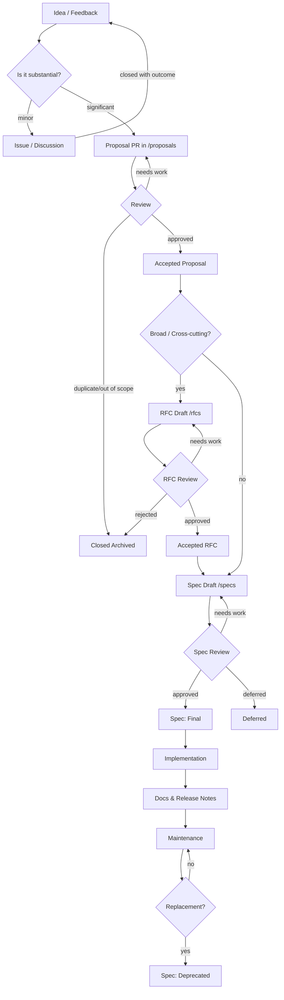

# Specifications (`/specs`)

This folder contains **formal specifications** for the SuperOffice developer platform and APIs.
Unlike proposals or RFCs, these documents represent **accepted, reference-level designs** that are ready for implementation and long-term use.

---

## 📝 When to Promote a Document to `/specs`

A proposal or RFC should be promoted to a **specification** when:

- It has been **accepted** through the proposal/RFC process.
- The design is **stable and agreed upon** by the SuperOffice team.
- It contains **sufficient technical detail** for developers to rely on.
- It is ready to be used as a **reference document** in implementation and documentation.

---

## 🛠️ Spec Lifecycle

Each spec has a **status**:

- **Draft** → Initial spec draft, under final review.
- **Final** → Approved and considered the reference implementation.
- **Deprecated** → No longer recommended; superseded by a newer spec.

---

## 📎 References

- [Proposals folder](../proposals/) → Idea-stage contributions.
- [RFCs folder](../rfcs/) → Deep technical designs.
- [Spec Template](./template.md) → Use this to create a new specification.

---

## 🛤️ Path of Promotion

The following diagram illustrates the typical path from idea to implementation:

✅ *Proposal → RFC → Spec → Implementation*

