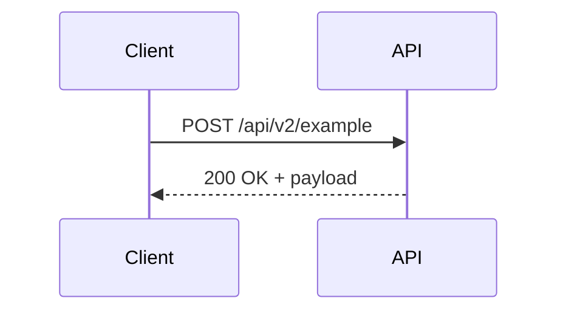

# [Specification Title]

- **Spec ID:** [area/name] (e.g., `rest/webhooks-v2`, `common/authentication`)  
- **Status:** Draft | Final | Deprecated  
- **Version:** 1.0  
- **Created:** YYYY-MM-DD  
- **Updated:** YYYY-MM-DD  

---

## 📖 Overview

Brief description of what this specification covers, its scope, and its relation to the platform.  

---

## 🎯 Goals

- List the primary objectives of this specification.  
- Example: Provide reliable webhook delivery with authentication and filtering.  

---

## 🚫 Non-Goals (Optional)

- List what this specification does **not** cover.  
- Example: Does not define event streaming (Kafka/WebSockets).  

---

## 🛠️ Technical Specification

- API endpoints (methods, URLs, parameters, request/response schemas)
- Data models (entities, relationships, attributes)
- Workflows and state diagrams
- Error handling and status codes
- Security considerations (authentication, authorization)
- Performance and scalability notes
- Backward compatibility and versioning strategy
- Example requests/responses, diagrams if relevant
- Any dependencies or prerequisites
- Testing and validation strategies

### Endpoints / APIs (if applicable)

- **Method:** [GET/POST/etc.]  
- **Endpoint:** `/api/vX/...`  
- **Authentication:** OAuth2 / System User / etc.  

#### Request Example

```http
POST /api/v2/example
Authorization: Bearer {token}
Content-Type: application/json

{
  "field": "value"
}
```

#### Response Example

```json
{
  "id": "123",
  "status": "ok"
}
```

---

### Data Models

| Field       | Type   | Description       |
| ----------- | ------ | ----------------- |
| `id`        | string | Unique identifier |
| `status`    | string | Current status    |
| `createdAt` | string | ISO8601 timestamp |

---

### Workflows / Diagrams (Optional)

Describe how this spec fits into workflows.
Mermaid diagram example:



---

## 📦 Backward Compatibility

- Migration considerations
- Versioning strategy
- Deprecation notes (if replacing older functionality)

---

## 🧪 Examples & Use Cases

- Example integrations or scenarios
- Edge cases and error handling examples

---

## 🌐 Security & Compliance

- Authentication requirements
- Authorization model
- Data protection / privacy considerations

---

## 📅 Implementation & Rollout

- Phases (e.g., Beta, GA, Deprecation of legacy)
- Dependencies on other specs or releases

---

## 📎 References

- Related proposals: [../proposals/2025/001-webhooks-improvements.md](../proposals/2025/001-webhooks-improvements.md)
- Related RFCs: [../rfcs/2025/001-example.md](../rfcs/2025/nnn-placeholder.md)
- External standards (e.g., [OAuth 2.0 RFC6749](https://datatracker.ietf.org/doc/html/rfc6749))